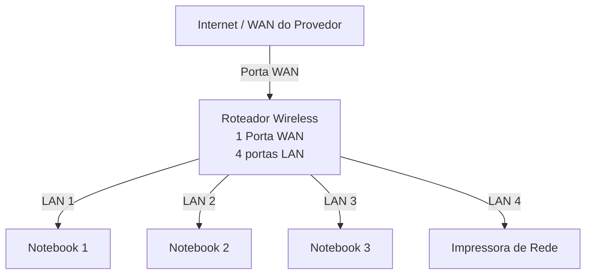
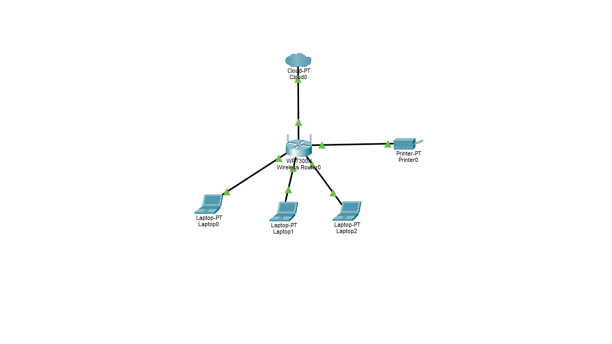

# Laboratório de Redes 01 - Projeto de Rede Local  
Projeto desenvolvido na disciplina de Redes de Computador no curso Técnico de Informática do SENAC 

Aluno: Eduardo Dias Lima 

Professor: José de Assis

Data: 09/03/2026

---
## 1.Objetivo 
Implementar uma rede local simples conectando 3 notebooks a um roteador wireless com switch integrador e uma impressora de rede.

O projeto será realizado em duas etapas: 
1. Simulação da rede no Cisco Packet Tracer 
2. Implementação da rede no laboratório real
---

## 2. Equipamentos ultilizados neste labhoratório 
- 3 notebooks
- 1 roteador wireless com porta 1 porta WAN e 4 portas LAN
- 1 impressora
- cabos de rede 
---
## 3. Topologia da Rede 
Diagrama lógico da rede utilizada neste laboratório: 

Imagem da Topologia utilizada no Laboratório: 

---
## 4. Plano de Endereçamento IP

Rede: 192.168.0.0/24

Gateway: 192.168.0.1

 | Dispositivo | Tipo de IP | Endereço IP | Observação |
 |-------------|------------|-------------|------------|
 | Roteador | Estático | 192.168.0.1 | IP do Roteador |
 | Impressora | Reserva DHCP | 192.168.0.103 | IP reservado pelo Roteador |
 | PC1 | Reserva DHCP | 192.168.0.100| IP reservado pelo Roteador| 
 | PC2 | DHCP | Automático | IP reservado pelo Roteador| 
 | PC3 |  DHCP | Automático | IP reservado pelo Roteador| 

 **Observação** 

 - A impressora e um dos notebooks utilizam reserva DHCP.
 - O roteador sempre atribui o mesmo IP a esses dispositivos.
 
 ---

 ## 5. Implementação no Laboratório Real

 Após a instalação, a rede foi montada fisicamente no laboratório.

 ## 6. Conclusão 

 Este laboratório permitiu compreender o funcionamneto de uma rede local simples, incluindo: 

 - Estrutura de uma rede doméstica ou de pequeno escritório
 - Utilização de um roteador com porta WAN e portas LAN
 - Funcionamentos do DHCP
 - Comunicação entre dispositivos na rede local
 - Utilização de uma impressora de rede
 - Compartilhamento de pastas na rede 
